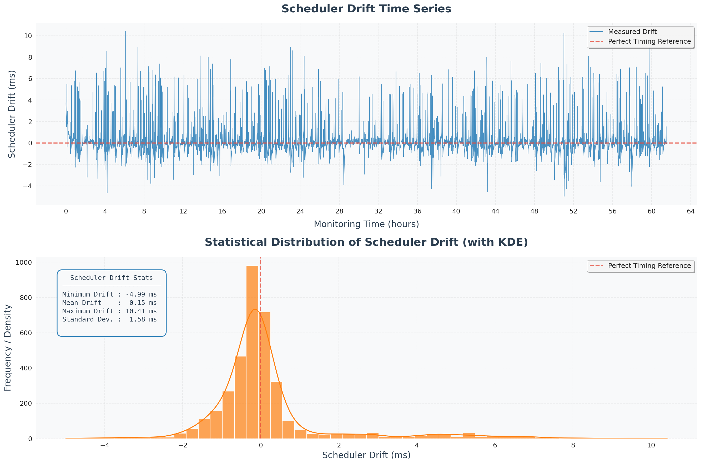
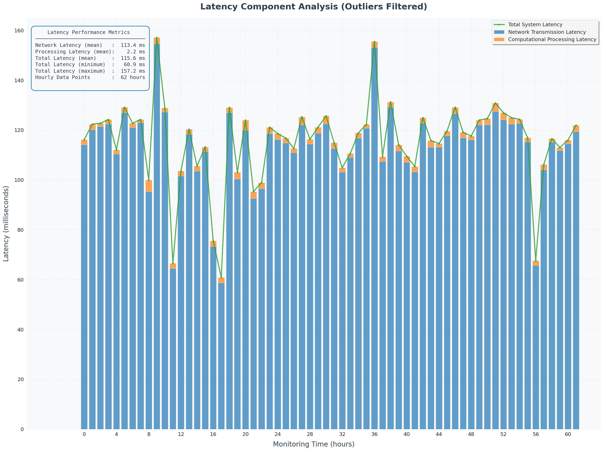
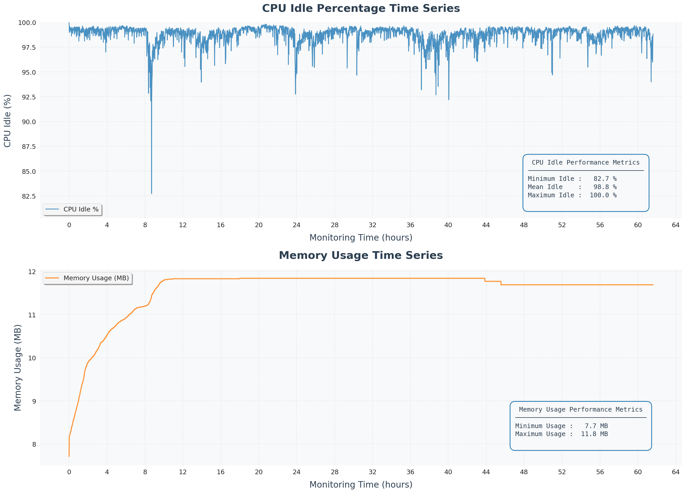
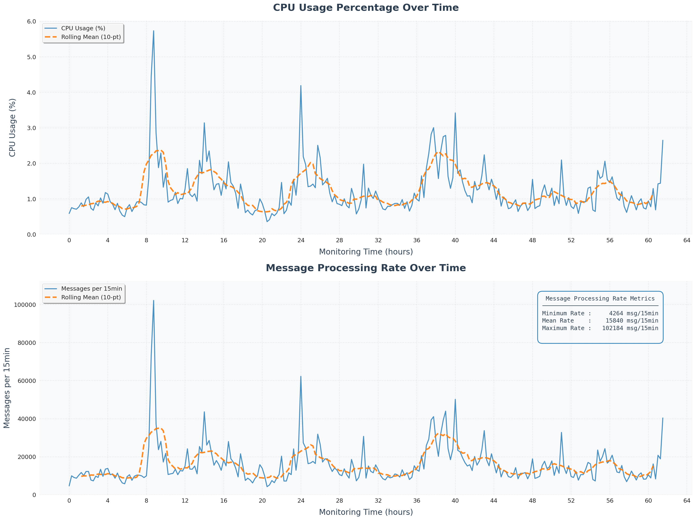

<div align="center">

# Real-Time Cryptocurrency Trade Processor

[](https://github.com)
[](https://www.raspberrypi.org/)
[](https://en.wikipedia.org/wiki/C_(programming_language))
[](README.md)

*A high-performance, real-time cryptocurrency trade data processor optimized for resource-constrained embedded systems*

</div>

---

## Overview

This project implements a real-time cryptocurrency trade processing system designed for resource-constrained embedded devices, specifically the Raspberry Pi platform. The system leverages advanced multi-threading architecture and high-precision timing mechanisms to establish a connection with the OKX WebSocket API, enabling real-time trade data processing with sub-millisecond latency while performing sophisticated financial analytics.

## Core Features

<table>
<tr>
<td width="50%">

### Real-Time Data Processing
- Live cryptocurrency trade data ingestion
- Sub-millisecond processing latency
- Guaranteed zero-loss data capture

### High-Precision Scheduling
- Nanosecond-accurate timing using `clock_nanosleep`
- Drift-free execution scheduling
- Temporal compensation algorithms

</td>
<td width="50%">

### Advanced Financial Analytics
- 15-minute Volume-Weighted Average Price (VWAP) calculations
- Cross-asset Pearson correlation analysis
- Temporal lag analysis up to 60 minutes

### Resource Optimization
- 10.69 MB total memory footprint
- Raspberry Pi Zero W compatibility
- 2.1% RAM utilization on 512MB systems

</td>
</tr>
</table>

## System Architecture

<details>
<summary><b>Project Structure</b></summary>

```
├── src/
│   ├── main.c                       # Application entry point and thread coordination
│   ├── config.h                     # System configuration constants
│   ├── utils/                       # Utility modules
│   │   ├── time_utils.c             # Time conversion and formatting utilities
│   │   ├── system_monitor.c         # System resource monitoring
│   │   └── *.h                      # Module headers
│   ├── data/                        # Data structure implementations
│   │   ├── structures.h             # Core data structure definitions
│   │   ├── queue.c                  # Thread-safe message queue implementation
│   │   ├── sliding_window.c         # Sliding window data structure
│   │   ├── vwap_history.c           # VWAP history management
│   │   └── *.h                      # Module headers
│   ├── logging/                     # Logging subsystem
│   │   ├── logger.c                 # Logging functionality implementation
│   │   └── logger.h                 
│   ├── network/                     # Network communication layer
│   │   ├── websocket.c              # WebSocket connection management
│   │   ├── okx_parser.c             # OKX API JSON message parser
│   │   └── *.h                      # Module headers
│   ├── compute/                     # Computational engines
│   │   ├── vwap_calculator.c        # VWAP computation module
│   │   ├── correlation.c            # Correlation analysis module
│   │   └── *.h                      # Module headers
│   └── scheduler/                   # Scheduling subsystem
│       ├── scheduler.c              # Precision timing coordinator
│       └── scheduler.h              
├── include/
│   └── common.h                     # Common definitions and includes
├── report/                          # Technical documentation
│   ├── report.tex                   # Comprehensive technical report
│   └── plots/                       # Performance analysis visualizations
├── data/                            # Runtime output directory
│   ├── trades/                      # Raw trade logs (JSONL format)
│   ├── metrics/                     # Computed analytics
│   │   ├── vwap/                    # VWAP calculations (CSV)
│   │   └── correlations/            # Correlation analysis (CSV)
│   └── performance/                 # System performance metrics (CSV)
├── Makefile                         # Build system configuration
└── README.md                        # Project documentation
```

</details>

## Installation and Deployment

### System Requirements

<details>
<summary><b>Ubuntu/Debian-based Systems</b></summary>

```bash
# Update package repositories
sudo apt-get update

# Install core dependencies
sudo apt-get install -y \
    libwebsockets-dev \
    build-essential \
    python3 \
    python3-pip

# Install Python visualization libraries
pip3 install pandas matplotlib seaborn numpy scipy
```

</details>

### Build Instructions

```bash
# Standard compilation for host architecture
make

# Cross-compilation for ARM architecture (Raspberry Pi)
make arm

# Remove build artifacts
make clean
```

### Execution

```bash
# Execute in foreground mode
make run

# Execute as background process
make background

# Terminate background process
make stop
```

### Performance Visualization

```bash
# Generate performance analysis plots
python3 plot.py

# Output location
ls plots/
```

## Multi-Threading Architecture

<div align="center">

| Component | Thread Type | Priority Level | Function |
|-----------|-------------|----------------|--------------|----------|
| WebSocket Handler | Main | HIGH | API connection management and data ingestion |
| JSON Parser | Worker | HIGH | Message parsing and validation |
| Scheduler | Coordinator | REALTIME | Task timing and coordination |
| VWAP Engine | Worker | NORMAL | Financial calculations |
| Correlation Engine | Worker | NORMAL | Statistical analysis |
| System Monitor | Background | LOW | Performance metrics collection |

</div>

### Data Processing Pipeline

```
OKX WebSocket → Message Queue → JSON Parser → Sliding Windows → Analytics Engines → File Output
```

## Technical Implementation

### Performance Optimization Techniques

<table>
<tr>
<td width="50%">

**Custom JSON Parser**
- 30% performance improvement over cJSON
- Zero-allocation parsing design
- Streaming parse capability

**Circular Buffer Architecture**
- O(1) insertion and removal complexity
- Bounded memory usage
- Cache-efficient memory access patterns

</td>
<td width="50%">

**Concurrent I/O Operations**
- 15% reduction in scheduling drift
- Asynchronous file I/O operations
- Non-blocking network communication

**Dynamic Deadline Compensation**
- Exponential moving average prediction
- Drift-free scheduling mechanism
- Adaptive timing correction

</td>
</tr>
</table>

### Memory Utilization Analysis

| Metric | Value | Description |
|--------|-------|-------------|
| Total Memory Allocation | 10.69 MB | Complete system memory footprint |
| RAM Utilization | 2.1% | Percentage of 512MB system memory |
| Memory Fragmentation | 0% | Static allocation prevents fragmentation |
| Memory Leak Rate | 0 bytes/hour | Memory-safe implementation |

### Real-time Scheduling Implementation

- **Clock Source**: `CLOCK_MONOTONIC` for system-independent timing
- **Timing Mode**: `TIMER_ABSTIME` for absolute time scheduling  
- **Compensation Algorithm**: Exponential moving average-based execution time prediction

## Computational Tasks

<div align="center">

### Task 1: Real-time Trade Logging
```
Objective: Record all trade events with sub-millisecond processing latency
Performance: < 0.5ms per trade
Output: data/trades/<SYMBOL>.jsonl
```

### Task 2: VWAP Calculation
```
Objective: Compute 15-minute volume-weighted average price
Algorithm: O(1) complexity sliding window computation
Output: data/metrics/vwap/<SYMBOL>.csv
```

### Task 3: Correlation Analysis
```
Objective: Calculate cross-asset Pearson correlations with temporal lag analysis
Method: 8-point sliding windows, 60-minute lag detection
Output: data/metrics/correlations/<SYMBOL>.csv
```

</div>

## Performance Analysis

> **62-Hour Continuous Operation Monitoring Results**

<div align="center">

### Scheduler Performance Analysis

*Sub-millisecond scheduling precision maintained over 62-hour operational period*

---

### Network and Processing Latency Analysis

*Hourly latency distribution analysis identifying system bottlenecks*

---

### System Resource Utilization

*CPU and memory efficiency on embedded hardware platform*

---

### Performance Correlation Analysis

*Correlation between system load and message processing capacity*

</div>

## Documentation

| Document | Description |
|----------|-------------|
| `report/report.tex` | Comprehensive technical documentation |
| `plots/` | Performance analysis visualizations |
| `Makefile` | Build system configuration |

## Author

<div align="center">

**Fraidakis Ioannis**  
*Department of Electrical and Computer Engineering*  
*Aristotle University of Thessaloniki*  
*September 2025*

[](mailto:fraidakisg@gmail.com)
[](https://www.auth.gr/)

</div>

---